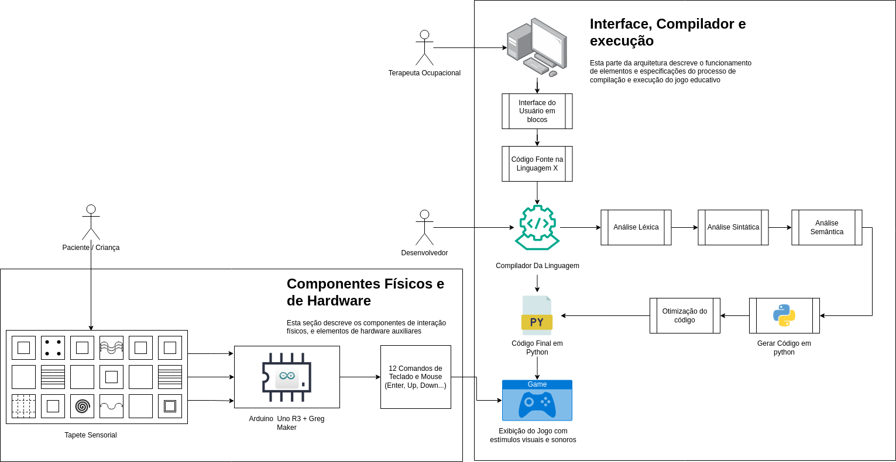

# Arquitetura do Sistema

## Introdução 

O objetivo principal deste documento é detalhar todos os componentes presentes em nosso sistema, bem como as tecnologias e usuários que interagirão com ele, visando oferecer uma visão abrangente e de alto nível dos componentes do sistema e suas respectivas funcionalidades, apresentadas de maneira progressiva e fácil de compreender, utilizando imagens e figuras para facilitar a compreensão.

## Arquitetura

Utilizando um diagrama de fluxo, a arquitetura demonstra a interação entre os componentes do sistema, segmenta-os em quadrantes e identifica os usuários responsáveis por cada ação. A arquitetura está dividida em dois quadrantes; á direita, temos a "Interface, Compilador e Execução", que engloba todos os aspectos relativos a IDE (Ambiente de Desenvolvimento Integrado) produzida neste repositório, desde o compilador a ser desenvolvido até a interface da mesma, focada na produção de jogos. Já no quadrante à esquerda temos "Componentes Físicos e Hardware", que inclui o tapete sensorial modificado com fios de cobre e o GregMaker, o último servindo como canal de comunicação com o sistema de "Interface, Compilador e Execução" citado anteriormente. Para facilitar a compreensão de uma descrição mais detalhada, a explicação dos componentes e suas interações serão feitas considerando os três usuários principais: o Terapeuta Ocupacional (TO), o Desenvolvedor e o Paciente/Criança.

### Terapeuta Ocupacional

Iniciando com o Terapeuta Ocupacional (TO), esse usuário interage com a interface, tendo como seu principal caso de uso a construção/execução de um jogo educativo que irá utilizar como seu controle o tapete sensorial. O TO atua diretamente com o computador, que apresenta a interface do usuário, com uma estrutura em blocos para facilitar o desenvolvimento dos já citados jogos, assim como o código fonte na linguagem denominada temporariamente como X. Esta linguagem foi nomeada como X devido à ausência de um nome específico até o momento atual, porém em documentos futuros é certo que esta receberá uma denominação definitiva.

Em termos práticos, o Terapeuta Ocupacional (TO) idealmente não necessitará compreender profundamente o funcionamento da linguagem X. Esta linguagem é projetada para ser facilmente compreensível por indivíduos sem conhecimento preliminar em programação, permitindo-lhes desenvolver jogos com facilidade e agilidade. A interface desempenha um papel crucial ao facilitar a interação entre o TO e a linguagem X, oferecendo ferramentas intuitivas e altamente acessíveis, assegurando que a utilização do sistema seja coesa e prática.

### Desenvolvedor

O Desenvolvedor, responsável por todo o setor de "Interface, Compilador e Execução", atua como a personificação da equipe de desenvolvimento que centraliza seus esforços neste repositório. Seu principal objetivo é desenvolver, principalmente, o compilador da linguagem X bem como a interface para interação com ela. O papel predominante do Desenvolvedor é atender às necessidades do Terapeuta Ocupacional (TO) durante a edição ou execução de um jogo, bem como compreender como realizar a comunicação das interações do paciente/criança para o sistema onde interage o TO (IDE). Isso assegura uma interação ágil entre os dois ecossistemas, resultando em um sistema coerente e funcional para todos os usuários envolvidos.

Dos componentes catalogados, é possível notar a "Análise Léxica", "Análise Sintática" e "Análise Semântica". Esses termos representam as etapas do compilador da linguagem, sendo seus objetivos reconhecer se os símbolos pertencem a linguagem, verificar se a sintaxe (ordem dos simbolos) está correta e realizar quaisquer verificações adicionais necessárias (verificar se uma variável foi inicializada antes de ser usada, se os tipos dos operandos são compatíveis, etc), respectivamente. Por fim, caso o código passe com êxito por todas as etapas, o compilador irá gerar um código em Python, que será executado pelo sistema, e será o responsável pela etapa final do sistema que é o funcionamento do jogo e a interação com o GregMaker.

### Paciente/Criança

O Paciente/Criança é o usuário final do sistema, com sua interação totalmente voltada para o quadrante de "Componentes Físicos e Hardware", e comunicando-se principalmente através do tapete sensorial. Este usuário utiliza o tapete como um periférico para navegar pelos jogos criados pelo Terapeuta Ocupacional (TO). O desenvolvedor não altera diretamente esta parte do sistema; toda comunicação é realizada através do GregMaker, uma placa equipada com um microcontrolador Arduino Uno R3, capaz de enviar até 12 sinais digitais ao computador, interpretados pelo sistema como entradas de teclado ou mouse.

O tapete sensorial, [um produto da "LDM Brinquedos Educativos"](https://loja.ldmbrinquedos.com.br/produto/tapete-sensorial/), foi modificado com a incorporação de fios de cobre, permitindo que sinais sejam enviados ao GregMaker quando o paciente/criança interage com ele, e este, por sua vez, comunica-se com o computador via conexão USB. Estrategicamente fixado em uma parede dentro de uma sala, é versátil e adaptável às diversas necessidades de acessibilidade das crianças, como variações no alcance e mobilidade dos braços. Ele possui diversas texturas que podem ser utilizadas como ferramentas á experiência do jogo, permitindo que o Terapeuta Ocupacional (TO) utilize sua criatividade para personalizar as atividades, adaptando-as de maneira flexível às necessidades individuais de cada criança, realizando os ajustes necessários através da IDE.

## Lista de Componentes

### Componentes Físicos e Hardware

- Tapete Sensorial
- GregMaker
- Computador (Desktop ou Notebook)

### Componentes Digitais e Software

- IDE (Ambiente de Desenvolvimento Integrado) / Interface
- Compilador da Linguagem X

## Conclusão

Este é um sistema isolado e completo, incorporando componentes de hardware e software para proporcionar uma experiência única e personalizada. O tapete sensorial, que representa o hardware, é projetado principalmente para a interação da criança, funcionando de maneira similar a um mouse e teclado e fornecendo, assim como esses periféricos, o controle para a criança sob o que está acontecendo na tela. Em contrapartida, a IDE (Ambiente de Desenvolvimento Integrado) é um componente de software onde o Terapeuta Ocupacional (TO) e o Desenvolvedor são mais ativos, sendo esta parte do sistema menos visível para a criança, e é a ferramenta que garante ao TO o controle sob a experiência que a criança irá ter em sua sessão de terapia.

Logo, por meio do diagrama de fluxo e detalhamento dos componentes, é possível validar essa arquitetura de sistema e garantir que os casos de uso dos usuários estão sendo atendidos.