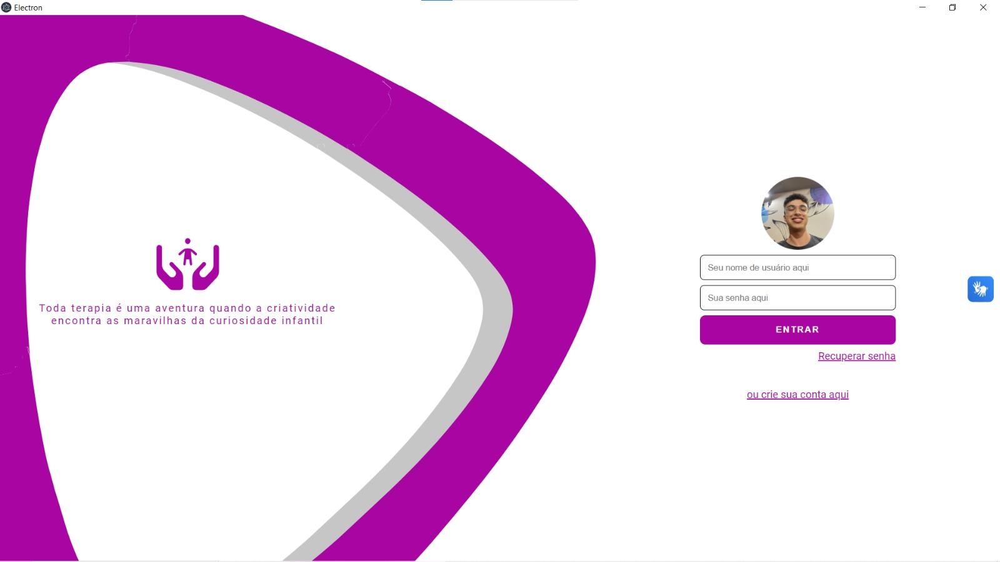

# Tapete Sensorial para Apoiar Pessoas com Leves Desordens Neurológicas e Sem Alteração/Restrição Sensorial em Atividades do Cotidiano

**Autores:**
- Cristiane Coutinho
- Felipe Sampaio
- Gabrio Lina
- João Pedro Alcaraz
- Moisés Cazé
- Pedro Silva
- Sergio Lucas

**Data:** Dezembro de 2023

**Abstract:**
_This article presents an innovative project for a sensory mat connected to the Greg Maker device, designed to help children, adolescents and adults with mild neurological disorders. In view of the global prevalence of disabilities, the importance of innovative solutions such as this one, aligned with the efforts of the Global Initiative for Cooperation in Assistive Technology (GATE) and the Association for the Assistance of Disabled Children (AACD), is highlighted. Based on related studies, the effectiveness of assistive technologies such as Paper-Based Assistive Technology and other solutions for children with cerebral palsy is highlighted. The article explores the relevance of early and personalized intervention to improve the autonomy and quality of life of these individuals. The results indicate not only technical feasibility, but also the potential positive impact on patients' independence and quality of life. This work represents a breakthrough at the intersection between the demand for assistance and advances in assistive technologies, pushing the field forward to build a more inclusive world._

# Introdução

A prevalência de deficiências no mundo é uma realidade impactante, afetando mais de um bilhão de pessoas, incluindo aproximadamente 240 milhões de crianças, conforme revelado por Zdravkova et al. (2022). Diante desse expressivo número, surge a necessidade urgente de explorar soluções inovadoras que possam melhorar a qualidade de vida desses indivíduos. A história das tecnologias assistivas remonta a um marco significativo: o desenvolvimento do Akouphone, o primeiro dispositivo assistivo a emergir. Este aparelho auditivo portátil, equipado com um microfone de carbono e auriculares, representou um avanço pioneiro no suporte àqueles com deficiências auditivas (Zdravkova et al., 2022). Desde então, a evolução dessas tecnologias tem sido constante, refletindo o compromisso em proporcionar soluções cada vez mais eficazes.

Reconhecendo a importância de garantir o direito humano fundamental à educação e combater a discriminação baseada em deficiência, a Organização Mundial da Saúde (OMS) lançou, em 2018, a Iniciativa de Cooperação Global em Tecnologia Assistiva (GATE), conforme destacado por Zdravkova et al. (2022).  A GATE surge como uma resposta assertiva, com seu objetivo inequívoco de "melhorar o acesso a produtos de assistência de alta qualidade e a preços acessíveis a nível mundial". Este movimento global reflete um comprometimento coletivo em superar as barreiras que limitam o acesso à educação e outros aspectos fundamentais da vida para indivíduos com deficiência.

A interseção entre as demandas crescentes por assistência às pessoas com deficiência e os avanços nas tecnologias assistivas é um campo no qual a Associação de Assistência à Criança Deficiente (AACD) se destaca. Com uma trajetória sólida de mais de 72 anos dedicados aos cuidados de saúde, a AACD assume um papel fundamental nesse cenário complexo. Atualmente, a instituição desempenha um papel crucial ao atender uma população diversificada, abrangendo tanto crianças quanto adultos afetados por diversas desordens neurológicas, como paralisia cerebral, amputações, poliomielite, doenças neuromusculares, esclerose múltipla, lesões cerebrais, lesões medulares e malformações congênitas.

Enquanto a AACD busca proporcionar cuidados abrangentes e especializados, a convergência com as iniciativas globais, como a Iniciativa de Cooperação Global em Tecnologia Assistiva (GATE), torna-se crucial. O comprometimento da AACD em oferecer assistência não apenas na esfera médica, mas também na promoção do acesso a tecnologias assistivas, alinha-se diretamente com os esforços globais para melhorar a qualidade de vida das pessoas com deficiência, conforme preconizado por Zdravkova et al. (2022). Nesse contexto, a sinergia entre as instituições globais e locais como a AACD assume uma importância estratégica, buscando abordagens integradas para enfrentar os desafios enfrentados por indivíduos com deficiência em todo o mundo.

A paralisia cerebral (CP) é uma condição que afeta o desenvolvimento motor em crianças, causando restrições de movimento e coordenação (Hamzah, Fatimahwati bt at al., 2022). A CP, incurável, demanda cuidados ao longo da vida, sendo a intervenção precoce crucial. A TA, ao fornecer dispositivos adaptativos, desempenha papel fundamental no desenvolvimento de habilidades adaptativas, melhoria da postura e na promoção da independência em crianças com CP (Hamzah, Fatimahwati bt at al., 2022).

A "appropriate paper-based technology - APT" emerge como uma solução sustentável e acessível localmente para a fabricação de dispositivos de assento e levantamento destinados a crianças com deficiência no Quênia, conforme indicado por Barton et al. (2020). A introdução de assentos e dispositivos personalizados, construídos com base em APT, demonstrou um impacto positivo significativo na vida de famílias que cuidam de crianças com paralisia cerebral de nível IV ou V do GMFCS. O uso regular desses dispositivos de apoio postural não apenas aprimorou as habilidades motoras das crianças, mas também melhorou sua capacidade funcional e participação em atividades diárias. Além disso, reduziu a carga de cuidados para as famílias e promoveu interações sociais mais robustas para as crianças. Entrevistas com os cuidadores primários ratificaram essas conclusões, destacando a valorização e alta utilização dos dispositivos de apoio postural por parte das crianças e suas famílias neste estudo. 

Nesse contexto, este artigo introduz o projeto de um tapete sensorial inovador, conectado ao dispositivo Greg Maker, especialmente adaptado para crianças, adolescentes e adultos com leves desordens neurológicas. Esse tapete proporciona uma experiência lúdica e personalizada, estimulando sensações táteis e proprioceptivas que desempenham um papel fundamental na integração do sistema nervoso central e periférico. Tais estímulos favorecem respostas motoras funcionais, melhoram o desempenho nas atividades de vida diária (AVD) e estimulam funções cognitivas, como discriminação figura-fundo, memória visual e relações espaciais.

Em consonância com a importância da acessibilidade, está sendo desenvolvida uma IDE (Ambiente de Desenvolvimento Integrado) para simplificar e agilizar as configurações, permitindo que terapeutas ocupacionais proporcionem a melhor experiência possível aos pacientes. Para atingir esse objetivo, será criada uma linguagem de programação que execute as alterações de maneira eficiente, incorporando conceitos fundamentais de compiladores, como analisador léxico e analisador sintático. Os benefícios dessa abordagem incluem facilidade de uso, personalização específica, feedback de monitoramento e integração com outros sistemas.

Por fim, este trabalho se alinha integralmente aos esforços da AACD para capacitar seus pacientes e profissionais com as mais recentes ferramentas e recursos de Tecnologia Assistiva. A expectativa é que o tapete sensorial, conectado ao Greg Maker e manipulado por meio da IDE, represente uma solução inovadora e acessível, atendendo às necessidades de indivíduos com desordens neurológicas leves. Essa abordagem visa auxiliar essas pessoas no desenvolvimento de respostas rápidas e adaptativas para enfrentar as demandas cotidianas, consolidando a interseção entre as demandas crescentes por assistência e os avanços constantes nas tecnologias assistivas.

# Estudos relacionados

Neste segmento, apresentamos estudos relevantes que complementam a compreensão do uso da tecnologia assistiva na reabilitação de indivíduos com deficiências neurológicas, com um enfoque especial em crianças com paralisia cerebral.

O artigo “The efficacy of appropriate paper-based technology for Kenyan children with cerebral palsy.” Barton, Catherine E. et al. 2020 aborda a paralisia cerebral (PC), uma condição neurológica prevalente em crianças, com ênfase em sua alta incidência no Quênia. Cerca de 40% das crianças com PC enfrentam formas severas não ambulantes, necessitando de apoio terapêutico ao longo da vida. Dispositivos de suporte postural, como cadeiras e estruturas de pé, são empregados como tecnologia assistiva, visando superar desafios motores decorrentes de problemas como controle motor anormal e fraqueza muscular. No entanto, em países de baixa e média renda, como o Quênia, o acesso a tecnologias assistivas é limitado. O estudo propõe uma solução de baixo custo, a Tecnologia Assistiva Baseada em Papel (APT), desenvolvida pela organização Cerebral Palsy Africa. Essa abordagem visa proporcionar dispositivos personalizados e acessíveis, usando papel reciclado, jornal e cola à base de farinha. O estudo avalia a eficácia da APT na qualidade de vida e participação de crianças com PC grave em uma comunidade rural queniana, destacando a necessidade de soluções acessíveis e culturalmente adaptadas. O artigo também ressalta a falta de evidências objetivas sobre a eficácia da APT, propondo uma avaliação abrangente por meio de métodos quantitativos e qualitativos.

O estudo "Assistive technology for promoting adaptive skills of children with cerebral palsy: ten cases evaluation" investigou o uso de tecnologia assistiva para aprimorar as habilidades adaptativas de crianças com paralisia cerebral. Dez crianças participaram do estudo, que foi dividido em três fases distintas, cada uma focada em aspectos específicos da interação com a tecnologia assistiva. Os resultados indicaram uma melhoria significativa no desempenho e na participação ativa dos participantes, sugerindo que a tecnologia assistiva pode ser uma ferramenta valiosa na promoção da independência dessas crianças. Os avaliadores sociais deram pontuações favoráveis ao uso da tecnologia e dos programas, indicando que programas baseados em tecnologia assistiva foram eficazes para promover a independência de crianças com paralisia cerebral ​(Stasolla et al., 2018).

O estudo realizado por Hamzah, Fatimahwati bt at al., 2022 "A Systematic Review of Assistive Technology Devices to Promote Independent Living in Children with Cerebral Palsy" apresenta uma revisão sistemática sobre dispositivos de tecnologia assistiva para crianças com paralisia cerebral na Malásia. O artigo destaca a necessidade de dispositivos adaptativos para melhorar a autonomia e qualidade de vida dessas crianças. A pesquisa abrangeu fontes de 2001 a 2020, identificando 46 fontes confiáveis de 80 revisadas. O texto aborda a introdução à paralisia cerebral, experiências em desenvolver auxílios especiais, a condição da paralisia cerebral em crianças e a importância da tecnologia assistiva na melhoria da postura e habilidades adaptativas. O estudo conclui ressaltando a irreversibilidade da paralisia cerebral, a importância da intervenção precoce e a necessidade de mais pesquisas para garantir a eficácia dos dispositivos de tecnologia assistiva.

O estudo "Review of assistive smart-home technology for people with physical and mobility disabilities" conduzido por Oussama El Ghoul e Mada Center, explora o uso de tecnologia assistiva de casa inteligente para pessoas com deficiências físicas e de mobilidade. Focando em automação residencial através de computadores, eletrônicos e telecomunicações, o estudo destaca como essas tecnologias oferecem segurança, conforto e facilitam a socialização. As inovações incluem controle de equipamentos domésticos por voz ou controle remoto, adaptando a tecnologia à necessidade do usuário, como interruptores adaptados e dispositivos de monitoramento remoto. Esses dispositivos são parte integrante da Internet das Coisas (IoT) e Internet das Coisas Médicas (IoMT), oferecendo uma gama de sensores e atuadores para suportar cada movimento. O estudo conclui que a automação residencial é uma solução eficaz para pessoas com deficiência, aumentando sua autonomia e melhorando significativamente a qualidade de vida (Oussama Ghoul et al. 2021).

No estudo "Cutting-edge communication and learning assistive technologies for disabled children: An artificial intelligence perspective. Frontiers in Artificial Intelligence" de Zdravkova et al., 2022, uma análise aprofundada é fornecida sobre o impacto dos componentes e soluções de inteligência artificial (IA) que sustentam o desenvolvimento de tecnologias assistivas de ponta para crianças com necessidades especiais. Diversas deficiências são abordadas, apresentando as mais recentes tecnologias assistivas que aprimoram a comunicação e a educação de crianças com deficiência, bem como as tecnologias de IA que possibilitaram seu desenvolvimento. O artigo conclui com uma perspectiva de IA sobre futuras tecnologias assistivas e as preocupações éticas decorrentes do uso de tecnologias avançadas de comunicação e aprendizado para crianças com deficiências.

# Material e métodos

## Objetivo do Projeto

O principal objetivo deste projeto é desenvolver um ambiente terapêutico assistivo utilizando um tapete sensorial conectado ao dispositivo Greg Maker. Esse tapete é especialmente adaptado para crianças, adolescentes e adultos com leves desordens neurológicas, visando melhorar sua independência e qualidade de vida.

## Desenvolvimento do Ambiente de Desenvolvimento Integrado (IDE)

1. **Descrição Geral do IDE:** O Ambiente de Desenvolvimento Integrado (IDE) é uma ferramenta projetada para terapeutas ocupacionais que atendem pacientes com Paralisia Cerebral. O IDE visa otimizar a experiência dos profissionais, facilitando o planejamento e a implementação de atividades terapêuticas de maneira eficiente e interativa.

2. **Funcionalidades do IDE:**
   - **Criação de Perfis e Cadastro de Pacientes:** Permite a criação de perfis de usuário e o cadastro de pacientes, proporcionando um ambiente personalizado para cada indivíduo.
   - **Construção Interativa de Sequências de Atividades Terapêuticas:** Oferece uma interface interativa para a construção de sequências de atividades terapêuticas no tapete sensorial.
   - **Acompanhamento e Avaliação:** Possibilita o acompanhamento das atividades executadas no tapete sensorial, gerando feedbacks essenciais para a avaliação e evolução do tratamento.

3. **Desenvolvimento Técnico do IDE:**
   - **Framework e Linguagens Utilizadas:** O IDE foi desenvolvido utilizando o framework Electron, que permite a criação de uma interface semelhante a aplicações web. Para melhorar a dinâmica das interfaces, foram utilizadas o React, uma biblioteca JavaScript para construção de interfaces de usuário, e TypeScript, uma extensão de JavaScript que adiciona tipagem estática.
   - **Acessibilidade:** Adesão às Diretrizes de Acessibilidade para o Conteúdo da Web (WCAG) para garantir que o IDE seja acessível a uma ampla gama de usuários, incluindo aqueles com diferentes habilidades e necessidades.

## Compilador e Integração com o Hardware (Tapete Sensorial)

1. **Descrição do Compilador:** O Compilador é um componente fundamental do projeto, atuando como intermediário entre o hardware (tapete sensorial) e o software (IDE). Ele traduz as instruções da terapeuta para que o Greg Maker possa implementá-las efetivamente no tapete sensorial, garantindo precisão e eficácia.

2. **Funcionalidade de Sequenciamento de Blocos:** Introdução de uma abordagem lúdica e intuitiva, onde os blocos representam quadrantes do tapete sensorial. Isso simplifica a programação, facilitando o aprendizado e a utilização por parte dos terapeutas.

3. **Implementação de Princípios do No Code:** Facilita a programação sem a necessidade de codificação extensiva, tornando o processo mais acessível aos terapeutas. Permite a criação de feedbacks personalizados em diversas formas de comunicação, como som, escrita e elementos lúdicos.

## Avaliação da Experiência do Usuário e Resultados

1. **Foco na Usabilidade e Acessibilidade:** A experiência do usuário foi otimizada para garantir que os terapeutas possam criar atividades terapêuticas de forma eficiente, promovendo a evolução das habilidades de indivíduos com paralisia cerebral.

2. **Funcionalidade Independente da Conectividade com a Internet:** Desenvolvido como um sistema desktop, o IDE garante funcionalidade independente da conectividade com a internet, atendendo às necessidades de ambientes hospitalares, como a AACD, onde falhas de conexão são comuns.

## Considerações Técnicas

1. **Tecnologias Utilizadas:** Uso do framework Electron, React, TypeScript e princípios do No Code para simplificar a programação e a utilização do sistema por terapeutas.

2. **Adesão às Diretrizes de Acessibilidade:** Garantia de que o IDE seja acessível a uma ampla gama de usuários, incluindo aqueles com diferentes habilidades e necessidades.

3. **Compilador como Componente Crítico:** O Compilador desempenha um papel crucial na tradução eficaz das instruções terapêuticas para o hardware, assegurando a precisão e eficácia da aplicação.

## Resultados Esperados

1. **Contribuição para a AACD:** O projeto visa contribuir integralmente aos esforços da AACD em capacitar pacientes e profissionais com as mais recentes ferramentas da Tecnologia Assistiva.

2. **Maior Independência e Qualidade de Vida:** Espera-se que o tapete sensorial, conectado ao Greg Maker e manipulado pela IDE, represente uma solução inovadora e acessível, atendendo às necessidades de indivíduos com desordens neurológicas leves.

# Resultados 

O desenvolvimento do Ambiente de Desenvolvimento Integrado (IDE) destinado a Terapeutas Ocupacionais que atendem pacientes com leves desordens Neurológicas representa um avanço notável no campo da Tecnologia Assistiva, destacando-se por seu foco especial em usabilidade e acessibilidade. O IDE, combinado com um tapete sensorial inovador, visa otimizar a experiência dos profissionais, simplificando o planejamento e a implementação de atividades terapêuticas de maneira eficiente e interativa.

1. **Login e criação de usuários**

Desenvolvido como um sistema desktop, o IDE assegura funcionalidade independente da conectividade com a internet, uma característica crucial em ambientes hospitalares como a AACD, onde falhas de conexão são comuns. A aplicação permite a criação de perfis de usuário e o cadastro de pacientes, proporcionando uma gestão eficaz do ambiente terapêutico.

2. **Construção Iterativa**

A plataforma permite o terapeuta a acompanhar seus pacientes, criar novos usuários a partir de jogos já existentes ou desenvolver novos jogos de forma intuitiva. A construção iterativa de atividades terapêuticas promove uma abordagem flexível e personalizada para atender às necessidades específicas de cada paciente.
1. **Tapete Sensorial**

A IDE é totalmente integrada ao tapete via dispositivo Greg Maker, facilitando a programação para o terapeuta. A plataforma oferece uma visualização detalhada do tapete, proporcionando uma compreensão aprimorada e uma programação eficiente de blocos, promovendo uma terapia mais direcionada.

Para tornar o jogo mais lúdico, a plataforma permite a criação de telas no próprio computador, integradas ao tapete, para tornar as mensagens de feedback mais personalizadas. Essa abordagem inovadora enriquece a experiência terapêutica, tornando-a envolvente e adaptada às preferências individuais de cada paciente.

Para garantir o funcionamento harmonioso de todos os elementos, a plataforma conta com uma IDE voltada para o desenvolvimento de lógica, de forma simples e lúdica, permitindo que o terapeuta desenvolva jogos de maneira eficaz. O compilador desempenha um papel fundamental na tradução efetiva das instruções terapêuticas para o hardware, garantindo precisão e eficácia na execução das atividades propostas.

Em resumo, os resultados obtidos até o momento não apenas validam a viabilidade técnica do projeto, mas também destacam seu potencial impacto positivo na melhoria da independência e qualidade de vida dos pacientes atendidos pela AACD. 

# Conclusão

O presente artigo representa um marco significativo na interseção entre a crescente demanda por assistência a pessoas com deficiência e os avanços contínuos em tecnologias assistivas. Ao abordar a prevalência global de deficiências e a necessidade premente de soluções inovadoras, destacamos a importância de iniciativas como a Iniciativa de Cooperação Global em Tecnologia Assistiva (GATE) da Organização Mundial da Saúde e o compromisso da Associação de Assistência à Criança Deficiente (AACD) em empregar soluções eficazes.

O projeto apresentado, centrado em um tapete sensorial conectado ao dispositivo Greg Maker e um Ambiente de Desenvolvimento Integrado (IDE), visa oferecer uma solução acessível e inovadora para indivíduos com desordens neurológicas leves. Através da revisão de estudos relacionados, identificamos a relevância dessas tecnologias no contexto das necessidades de crianças com paralisia cerebral e outras condições neurológicas.

Os resultados alcançados até o momento evidenciam não apenas a viabilidade técnica do projeto, mas também seu potencial impacto positivo na melhoria da independência e qualidade de vida dos pacientes. Ao contribuir para os esforços da AACD, o projeto está alinhado com a missão de capacitar pacientes e profissionais com as mais recentes ferramentas de tecnologia assistiva.

Em última análise, este trabalho não apenas reflete os avanços tecnológicos na área, mas também reforça a importância de parcerias entre instituições, pesquisadores e profissionais de saúde na busca por soluções inovadoras que possam fazer a diferença na vida daqueles que enfrentam desafios decorrentes de desordens neurológicas. Acreditamos que este projeto pode servir como um catalisador para futuras pesquisas e desenvolvimentos, impulsionando ainda mais o campo das tecnologias assistivas e contribuindo para a construção de um mundo mais inclusivo.

# Referências Bibliográficas 

Barton, Catherine E. et al. “The efficacy of appropriate paper-based technology for Kenyan children with cerebral palsy.” Disability and Rehabilitation: Assistive Technology 17 (2020): 927 - 937. doi: 10.1080/17483107.2020.1830442. Epub 2020 October 19. 

Fabrizio Stasolla , Alessandro O Caffò , Viviana Perilli , Adele Boccasini , Rita Damiani , Fiora D'Amico. (2018). Assistive technology for promoting adaptive skills of children with cerebral palsy: ten cases evaluation. Assistive Technology, 4(5):489-502. doi: 10.1080/17483107.2018.1467972. Epub 2018 May 6.

Hamzah, Fatimahwati bt and Saiful Hasley Ramli. “A Systematic Review of Assistive Technology Devices to Promote Independent Living in Children with Cerebral Palsy.” Proceedings of the 2nd International Conference on Design Industries & Creative Culture, DESIGN DECODED 2021, 24-25 August 2021, Kedah, Malaysia (2022): doi: 10.4108/eai.24-8-2021.2315270

Oussama Ghoul, Mada Center. (2019). Review of assistive smart-home technology for people with physical and mobility disabilities. Assistive Technology, Epub 2021 October 26.

Zdravkova, K., Krasniqi, V., Dalipi, F., & Ferati, M. (2022). Cutting-edge communication and learning assistive technologies for disabled children: An artificial intelligence perspective. Frontiers in Artificial Intelligence, doi: 10.3389/frai.2022.970430

