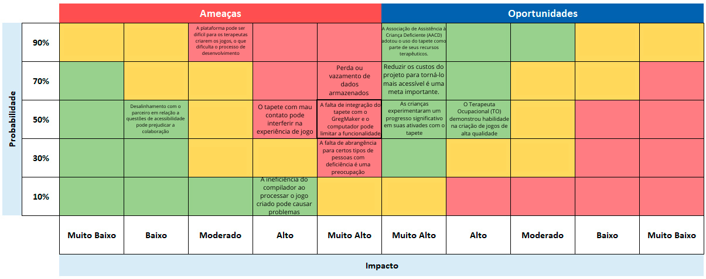
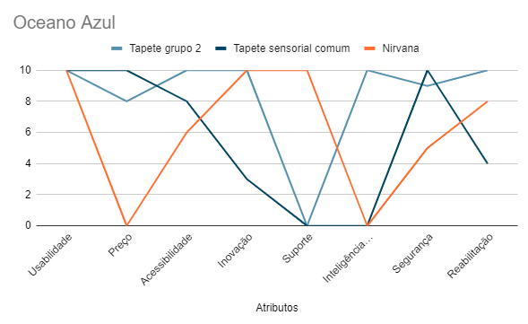
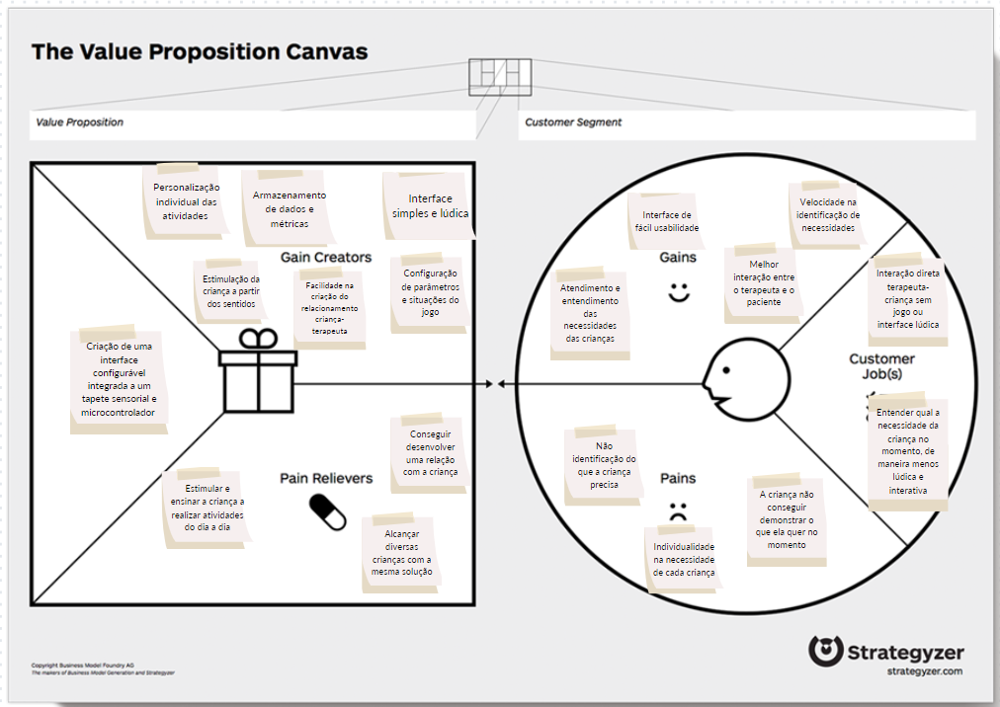

# Entendimento de negócio

## TAM - Total Addressable Market

A análise do Total Addressable Market (TAM) para o mercado de saúde voltado para a reabilitação de pacientes PCD (Pessoas com Deficiência) envolve a avaliação do tamanho desse mercado específico, identificando a demanda potencial por serviços de reabilitação.

### Identificação do Mercado-Alvo

O mercado-alvo é composto por pessoas com deficiência (PCD) que necessitam de serviços de reabilitação para melhorar sua qualidade de vida e funcionalidade. Isso pode incluir PCD de todas as faixas etárias e com uma variedade de condições, como lesões neuromusculares, paralisias, amputações, lesões medulares, acidentes vasculares cerebrais, entre outras.

### Estimativa do Número de PCD

O Brasil tem aproximadamente 18,6 milhões de pessoas com deficiência, considerando a população com idade igual ou superior a dois anos, segundo estimativas feitas pelo Instituto Brasileiro de Geografia e Estatística (IBGE), com base na Pesquisa Nacional de Amostra de Domicílios Contínua (PNAD Contínua) de 2022. No entanto, é importante lembrar que esses números podem variar com o tempo e devem ser periodicamente atualizados.

### Estimativa TAM

Para calcular o TAM, foi multiplicado o número estimado de PCD pelo custo médio anual da reabilitação por paciente. Isso pode incluir custos de terapia, assistência médica, dispositivos de auxílio, medicamentos e outros serviços relacionados.

- Tamanho da população PCD: 18,600,000
- Média de gastos por ano: R$ 110,880

Estimativa TAM: R$ 2,062,368,000,000

## Matriz de Risco

### Ameaças

- "O tapete com mau contato pode interferir na experiência de jogo":
  - Realizar manutenção periódica do tapete para garantir que ele funcione corretamente.
  - Incorporar sistemas de alerta que notifiquem os usuários sobre problemas de conexão.
  - Fornecer orientações claras aos usuários sobre como manter o tapete em boas condições.

- "A ineficiência do compilador ao processar o jogo criado pode causar problemas":
  - Atualizar o compilador e o software regularmente para garantir melhor desempenho.
  - Oferecer suporte técnico e recursos de solução de problemas aos desenvolvedores de jogos.
  - Realizar testes rigorosos antes do lançamento de qualquer jogo.

- "Desalinhamento com o parceiro em relação a questões de acessibilidade pode prejudicar a colaboração":
  - Estabelecer uma comunicação aberta e regular com o parceiro para garantir alinhamento constante.
  - Desenvolver diretrizes claras de acessibilidade para garantir que ambas as partes estejam na mesma página.
  - Promover a colaboração e a resolução de conflitos de forma construtiva.

- "A falta de abrangência para certos tipos de pessoas com deficiência é uma preocupação":
  - Investir em pesquisa e desenvolvimento para tornar o tapete mais inclusivo.
  - Colaborar com organizações de deficiência e profissionais de saúde para obter feedback e insights sobre a acessibilidade.
  - Manter um compromisso contínuo com a acessibilidade e a inclusão.

- "O não cumprimento dos prazos estabelecidos, devido à alta complexidade do projeto, é um desafio":
  - Estabelecer prazos realistas com base na complexidade do projeto.
  - Criar um plano de gerenciamento de projetos eficaz com etapas claras e metas intermediárias.
  - Alocar recursos adequados e monitorar o progresso regularmente para evitar atrasos.

- "A possibilidade de perda ou vazamento de dados armazenados durante a sessão é uma preocupação de segurança":
  - Implementar medidas de segurança robustas, como criptografia de dados e autenticação de usuários.
  - Fornecer treinamento aos terapeutas sobre a segurança dos dados e a importância de seguir procedimentos seguros.
  - Realizar auditorias de segurança regulares para identificar e corrigir vulnerabilidades.

- "A falta de integração do tapete com o GregMaker e o computador pode limitar a funcionalidade":
  - Trabalhar em estreita colaboração com os desenvolvedores do GregMaker e o sistema do computador para melhorar a integração.
  - Manter um diálogo constante para garantir a compatibilidade contínua.
  - Atualizar o software conforme necessário para permitir uma integração mais suave.

- "A plataforma pode ser difícil para os terapeutas criarem os jogos, o que dificulta o processo de desenvolvimento":
  - Oferecer treinamento e suporte aos terapeutas para ajudá-los a dominar a plataforma.
  - Simplificar a interface do usuário e fornecer recursos de criação de jogos mais intuitivos.
  - Coletar feedback dos terapeutas e fazer melhorias com base em suas necessidades e experiências.

### Oportunidades

- "O Terapeuta Ocupacional (TO) demonstrou habilidade na criação de jogos de alta qualidade."
- "Reduzir os custos do projeto para torná-lo mais acessível é uma meta importante."
- "As crianças experimentaram um progresso significativo em suas atividades de reabilitação ao utilizar o tapete."
- "A Associação de Assistência à Criança Deficiente (AACD) adotou o uso do tapete como parte de seus recursos terapêuticos."

## Matriz de oceano azul
A análise considerou diversos atributos, como usabilidade, preço, acessibilidade, inovação, suporte, inteligência de dados, segurança e reabilitação. a maior nota significa melhor performance naquele atributo. Os produtos analisados foram, o tapete do grupo 2, um tapete generico disponível no mercado sem a integração tecnologica e por fim o Nirvana que é um dispositivo médico baseado em realidade virtual projetado especificamente para auxiliar a reabilitação motora em pacientes com distúrbios neuromotores.

| Atributos          | Tapete grupo 2 | Tapete sensorial comum | Nirvana |
|-------------------|----------------|-------------------------|---------|
| Usabilidade       | 10             | 10                      | 10      |
| Preço             | 8              | 10                      | 0       |
| Acessibilidade    | 10             | 8                       | 6       |
| Inovação          | 10             | 3                       | 10      |
| Suporte           | 0              | 0                       | 10      |
| Inteligência de dados | 10        | 0                       | 0       |
| Segurança         | 9              | 10                      | 5       |
| Reabilitação      | 10             | 4                       | 8       |

# Avaliação de Atributos

## Usabilidade:
- O "Tapete do Grupo 2" e o "Tapete Sensorial Comum" receberam uma nota máxima de 10, o que sugere que ambos são usáveis por todas as pessoas, incluindo o público-alvo.
- O "Nirvana" também recebeu uma nota alta de 10, indicando boa usabilidade.

## Preço:
- O "Nirvana" recebeu a nota mais alta (10) por ser o produto mais caro, custando em torno de um milhão de reais.
- O "Tapete do Grupo 2" obteve uma nota intermediária (8), sugerindo que é menos caro.
- O "Tapete Sensorial Comum" recebeu a nota mais baixa (0) por ser considerado o mais caro entre os três.

## Acessibilidade:
- O "Nirvana" obteve a nota mais baixa (6) na categoria de acessibilidade, indicando que ele não é tão adaptável a diferentes cenários de pessoas com deficiência.
- O "Tapete Sensorial Comum" também recebeu uma nota baixa (8).
- O "Tapete do Grupo 2" obteve a nota mais alta (10) em acessibilidade, sugerindo que é o mais adaptável a diferentes situações.

## Inovação:
- O "Tapete do Grupo 2" e o "Nirvana" receberam a mesma nota (10) na categoria de inovação, indicando que ambos são produtos tecnologicamente avançados e inovadores.
- O "Tapete Sensorial Comum" não parece ser altamente inovador e não obteve uma nota específica para esse atributo.

## Suporte:
- O "Tapete do Grupo 2" não obteve nota na categoria de suporte devido ao fim do projeto.
- O "Nirvana" e o "Tapete Sensorial Comum" não foram avaliados quanto a esse atributo.

## Inteligência de Dados:
- Apenas o "Tapete do Grupo 2" obteve nota (10) nessa categoria, indicando que ele coleta e utiliza dados de desenvolvimento da atividade com o paciente para criar métricas.
- O "Nirvana" e o "Tapete Sensorial Comum" não foram avaliados quanto a esse atributo.

## Segurança:
- Os três produtos foram avaliados quanto à segurança, mas os resultados não foram detalhados na análise.

## Reabilitação:
- O "Nirvana" é especificamente projetado para auxiliar na reabilitação motora, portanto, obteve uma nota alta (8) nesse atributo.
- O "Tapete do Grupo 2" também obteve uma nota considerável (4) em reabilitação.
- O "Tapete Sensorial Comum" não foi avaliado especificamente quanto a esse atributo.

## Análise

O "Tapete do Grupo 2" tem uma nota muito baixa em relação ao suporte, indicando que, de alguma forma, não oferece suporte, indicando o fim do projeto. No entanto, os concorrentes, "Tapete Sensorial Comum" e "Nirvana," oferecem suporte total com uma nota máxima de 10. Portanto, há uma oportunidade de criar um Oceano Azul ao aprimorar o suporte para o "Tapete do Grupo 2" e destacar essa vantagem em relação aos concorrentes.

Para explorar essa oportunidade:
- Desenvolver um plano de suporte abrangente para o "Tapete do Grupo 2," incluindo assistência técnica, atualizações, treinamento, documentação e manutenção contínua.
- Garantir que o suporte seja facilmente acessível e eficiente para os usuários.
- Promover a qualidade do suporte como um dos principais diferenciais do "Tapete do Grupo 2" em relação aos concorrentes.

Melhorar o suporte pode criar um Oceano Azul, uma vez que, de acordo com a análise, os concorrentes já têm um alto nível de desempenho em outros atributos, como usabilidade e inovação. Portanto, focar em uma área onde eles não se destacam pode criar uma vantagem competitiva única para o "Tapete do Grupo 2".

 

# Análise Financeira 

A análise financeira do projeto para a criação do tapete sensorial conectado, utilizando o Greg Maker como componente central, voltado para pessoas com leves desordens neurológicas na AACD, requer uma avaliação detalhada dos custos e projeções de receitas relacionadas ao projeto. É importante destacar que os valores apresentados a seguir são estimativas aproximadas, uma vez que o objetivo principal do projeto é fornecer uma solução inovadora para a AACD. Os custos de mão de obra mencionados são fornecidos apenas para fins de análise e planejamento, porém, como este é um projeto realizado por alunos com o principal propósito de aprendizado, não implicará em custos reais de mão de obra.

## Projeções de Custos

A projeção de custos é um processo crucial para o projeto, auxiliando na estimativa dos recursos financeiros necessários para sua execução. Abaixo, apresentamos uma lista geral dos principais custos, destacando o uso do Greg Maker, o tapete sensorial, e outros componentes eletrônicos.

## Desenvolvimento do Tapete Sensorial:

- Materiais (Tapete): R$ 400
- Greg Maker: R$ 500
- Outros componentes eletrônicos utilizados durante a construção e testes: R$ 200

---

- Total: R$ 1.100

## Estimativa de Mão de Obra

É importante ressaltar que a estimativa de mão de obra é meramente uma aproximação, uma vez que este projeto é realizado por alunos e, portanto, não envolve custos reais de mão de obra. Sete desenvolvedores trabalharão 2 horas por dia, 5 dias por semana, durante 1 ano (cerca de 200 dias). A taxa de custo por hora de trabalho de cada membro da equipe é estimada em R$ 30. Isso resultaria em uma estimativa média de custo relacionado à mão de obra no valor de R$ 252.000 por ano se fosse um projeto comercial.

## Projeções de Receitas

O projeto pode gerar receitas indiretas por meio de doações de empresas privadas, aumento da visibilidade da AACD e o desenvolvimento de novos produtos e serviços. Além disso, deve ser ressaltado que o impacto social positivo para pessoas com desordens neurológicas leves é um dos principais objetivos do projeto, oferecendo aprimoramento na qualidade de vida e novas oportunidades de interação, aprendizado e desenvolvimento.

**Obs:** Essas estimativas são baseadas em informações disponíveis até o momento e podem ser ajustadas à medida que o projeto avança.

 

# Proposta de Valor (Canvas Value Preposition)

Mapeamento da solução final a ser entregue através das principais dores e necessidades do cliente.

