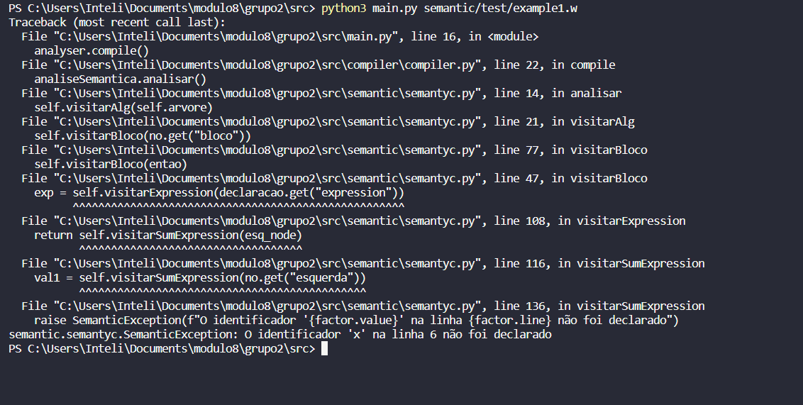
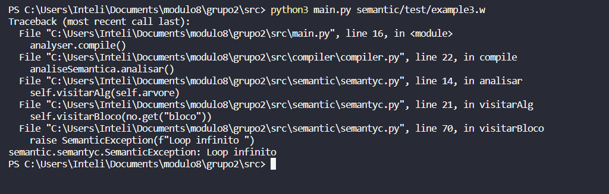

# Resultados: Semântico

*Artefato referente a Sprint 4*

# Sprint 4
## Testes
Pra essa sessão, os códigos que foram testados se encontram dentro da pasta teste do diretório src/semantic.

## Resultados
Para está dinâmica, o codigo todos os códigos testados retornam erros, por serem os testes propostos. Para testar um código correto, adicionar a pasta e rodar o programa.

### Teste 1
Nome do arquivo: example1.w
Exemplo semântico 1 (atribuição de variável não inicializada a ela própria):

Resultado: Código incorreto

### Teste 2
Nome do arquivo: example2.w
Exemplo semântico 2 (uso de variável não inicializada em expressões aritméticas):

Resultado: Código incorreto

### Teste 3
Nome do arquivo: example3.w
Exemplo semântico 3 (estrutura de repetição com bloco vazio deve gerar um erro semântico,
pois jamais terá seu estado alterado):

Resultado: Código incorreto
