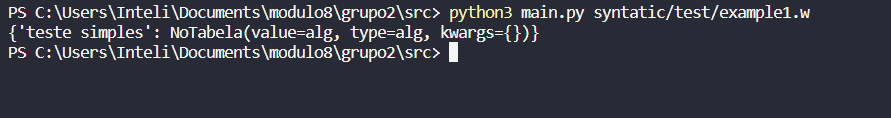
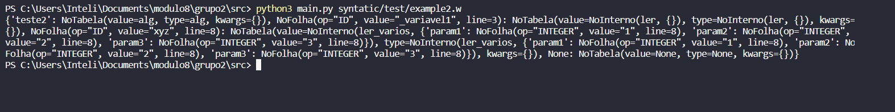
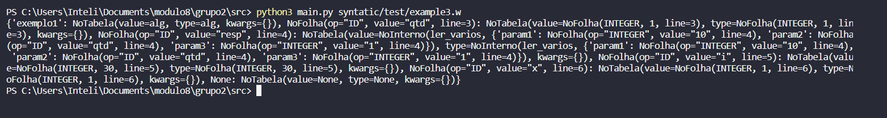
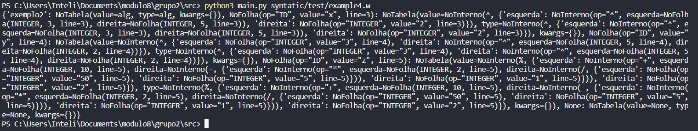
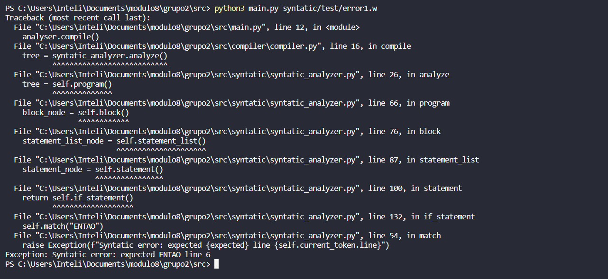
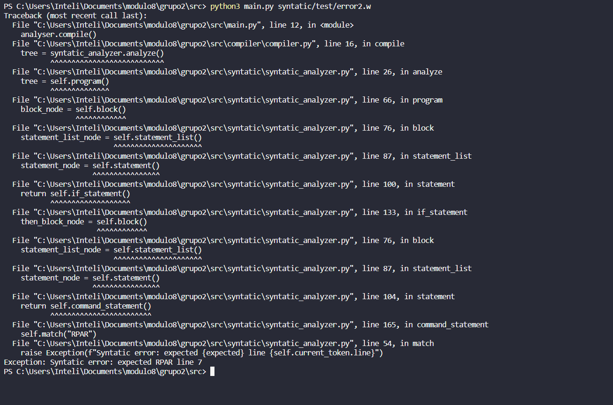

# Resultados: Sintático

*Artefato referente às Sprints 2 e 3*

# Sprint 3
## Testes
Pra essa sessão, os códigos que foram testados se encontram dentro da pasta teste do diretório src/syntatic.

## Resultados
Para está dinâmica, o codigo é considerado correto, quando ele retorna a tabela de tokens gerada, quando existir um erro no codigo, ele printa menssagem de erro e a linha.

### Teste 1
Nome do arquivo: example1.w

Resultado: Código correto

### Teste 2
Nome do arquivo: example2.w

Resultado: Código correto

### Teste 3
Nome do arquivo: example3.w

Resultado: Código correto

### Teste 4
Nome do arquivo: example3.w

Resultado: Código correto

### Teste de erro 1
Nome do arquivo: error1.w
No teste indicado, o erro etá na linha 6.

Resultado: O analisador aponta erro na linha 6

### Teste de erro 2
Nome do arquivo: error1.w
No teste indicado, o erro etá na linha 7.

Resultado: O analisador aponta erro na linha 6
